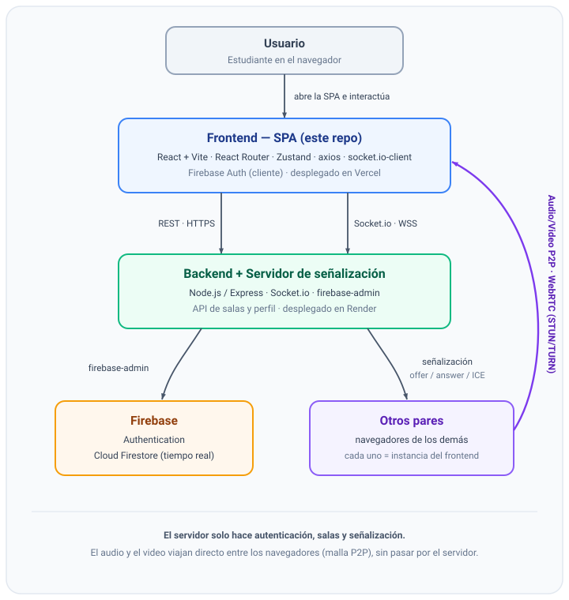
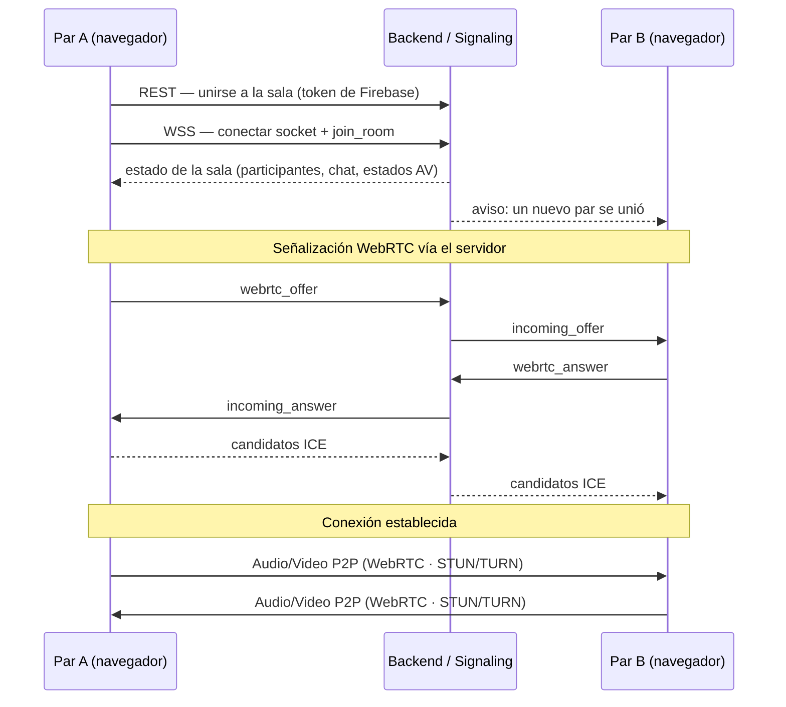

# Agora — Salón de Estudio Colaborativo en Tiempo Real (Frontend)


**Agora** es una aplicación web para **salas de estudio colaborativas en tiempo real**. Permite a un
grupo de estudiantes reunirse en una sala virtual, verse y escucharse por videollamada (WebRTC),
controlar su micrófono y cámara, compartir su pantalla y comunicarse por un chat, todo desde el
navegador y sin instalar nada.

Este repositorio contiene el **frontend** (la aplicación de una sola página, _SPA_, en React +
Vite). El backend —API REST y servidor de señalización de Socket.io— vive en un repositorio aparte:
**[proyecto-integrador-backend](https://github.com/jeangiraldoo/proyecto-integrador-backend)**.

---

## Tabla de contenidos

1. [¿Qué es Agora?](#qué-es-agora)
2. [Características principales](#características-principales)
3. [Despliegues en producción](#despliegues-en-producción)
4. [Arquitectura](#arquitectura)
5. [Stack tecnológico](#stack-tecnológico)
6. [Estructura del proyecto](#estructura-del-proyecto)
7. [Requisitos previos](#requisitos-previos)
8. [Puesta en marcha local (paso a paso)](#puesta-en-marcha-local-paso-a-paso)
9. [Variables de entorno](#variables-de-entorno-frontend)
10. [Scripts disponibles](#scripts-disponibles)
11. [Accesibilidad](#accesibilidad-a11y)
12. [Despliegue en producción](#despliegue-en-producción)
13. [Solución de problemas](#solución-de-problemas)
14. [Repositorios relacionados](#repositorios-relacionados)

---

## ¿Qué es Agora?

Cuando los estudiantes se reúnen a estudiar en línea suelen depender de herramientas genéricas
(Meet, Zoom, Discord) que no están pensadas para el flujo de una sesión de estudio: enlaces que se
pierden, chats que se borran al desconectarse y controles poco claros. Agora resuelve ese caso de
uso concreto con una interfaz simple y enfocada:

- Un usuario **crea una sala** y comparte su enlace/código con el grupo.
- Los demás **se unen** e ingresan a una **videollamada entre pares** (peer-to-peer).
- Dentro de la sala pueden **silenciar/activar** su micrófono, **encender/apagar** la cámara,
  **compartir pantalla** y **conversar por el chat**.

El objetivo del producto es que la sala sea **entendible, predecible y accesible**, cumpliendo
buenas prácticas de usabilidad (heurísticas de Nielsen) y accesibilidad (WCAG 2.2).

---

## Características principales

- 🔐 **Autenticación** con Firebase (correo/contraseña y Google), con rutas protegidas y perfil de
  usuario editable.
- 🏠 **Gestión de salas**: crear, unirse, renombrar y eliminar salas de estudio.
- 🎥 **Videollamada P2P (WebRTC)** en malla: el audio y el video viajan **directo entre los
  participantes**, no a través del servidor.
- 🎙️ **Control de estados AV**: silenciar micrófono y apagar cámara, con íconos de estado
  sincronizados en tiempo real entre todos los participantes.
- 🖥️ **Compartir pantalla** con retorno automático a la cámara al detener la compartición.
- 💬 **Chat de sala** en tiempo real (Socket.io).
- 🌐 **Robustez de red**: servidores STUN/TURN (Metered) para conectar a usuarios detrás de NAT o
  firewalls restrictivos, y aviso de "servidor despertando" ante _cold starts_ del backend.
- ♿ **Accesibilidad**: navegación por teclado, foco visible, _skip link_, gestión de foco al
  cambiar de ruta y respeto por `prefers-reduced-motion`.

---

## Despliegues en producción

| Servicio                              | URL                                                        |
| ------------------------------------- | ---------------------------------------------------------- |
| **Frontend** (Vercel)                 | https://proyecto-integrador-frontend-psi.vercel.app        |
| **Backend / Signaling** (Render)      | https://proyecto-integrador-backend-k2tf.onrender.com      |
| **Documentación de la API** (Swagger) | https://proyecto-integrador-backend-k2tf.onrender.com/docs |

> ℹ️ El backend usa el plan gratuito de Render: la **primera** petición tras un periodo de
> inactividad puede tardar ~30–60 s en responder (_cold start_). La aplicación lo detecta y muestra
> un aviso al usuario.

---

## Arquitectura

Agora sigue una arquitectura **cliente–servidor con video peer-to-peer**. El siguiente diagrama
muestra el flujo de arriba hacia abajo: desde el usuario en el navegador hasta la transmisión de
audio y video directa entre pares.

<p align="center">
  
</p>

### Las capas, en detalle

1. **Frontend (este repositorio).** SPA en React + Vite y TypeScript. Se encarga de la interfaz, el
   enrutado (React Router), el estado global (Zustand), las llamadas a la API (axios), la conexión
   de tiempo real (socket.io-client) y de establecer las conexiones WebRTC entre pares. La identidad
   del usuario se gestiona con **Firebase Authentication** desde el cliente. Se despliega en
   **Vercel**.

2. **Backend + servidor de señalización (repositorio aparte).** Node.js/Express expone la **API
   REST** (salas, perfil) y, con **Socket.io**, actúa como **servidor de señalización** de WebRTC:
   retransmite entre los pares los mensajes `offer`, `answer` e `ICE`, además de los eventos de
   estado de la sala (participantes, chat, mute/cámara, compartir pantalla). Usa `firebase-admin`
   para validar tokens y leer/escribir en Firestore. Se despliega en **Render**.

3. **Firebase.** **Authentication** provee la identidad; **Cloud Firestore** almacena los datos
   (perfiles, salas, historial de chat) en tiempo real.

4. **WebRTC (malla P2P).** Una vez establecida la conexión, el **audio y el video viajan
   directamente entre los navegadores** de los participantes, sin pasar por el servidor. Para
   atravesar NAT y firewalls se usan servidores **STUN** (descubrimiento de IP pública) y **TURN**
   (relevo de tráfico, proveedor **Metered**).

### Modelo de comunicación

Agora combina tres canales distintos, cada uno para lo que mejor sirve:

| Canal                  | Tecnología               | Para qué se usa                                             |
| ---------------------- | ------------------------ | ----------------------------------------------------------- |
| Petición/respuesta     | REST sobre HTTPS (axios) | Login, perfil, crear/unirse/renombrar/eliminar salas        |
| Eventos en tiempo real | WebSocket (Socket.io)    | Presencia, chat, estados de AV y **señalización** de WebRTC |
| Streaming multimedia   | WebRTC (P2P)             | Audio y video en vivo, directo entre pares (con STUN/TURN)  |

### Flujo de conexión a una sala (secuencia)



---

## Stack tecnológico

| Categoría             | Tecnologías                                                               |
| --------------------- | ------------------------------------------------------------------------- |
| **UI**                | React 19, React Router 7, Tailwind CSS 3.4                                |
| **Lenguaje/Build**    | TypeScript 6, Vite 8                                                      |
| **Estado**            | Zustand 5                                                                 |
| **Red / tiempo real** | axios (REST), socket.io-client 4 (WebSocket), WebRTC nativo del navegador |
| **Identidad**         | Firebase Authentication (SDK web)                                         |
| **Calidad**           | ESLint 10 (con `eslint-plugin-jsx-a11y`), Prettier 3.8                    |
| **Despliegue**        | Vercel (frontend) · Render (backend)                                      |

---

## Estructura del proyecto

```
proyecto-integrador-frontend/
├── docs/
│   └── architecture.svg     # Diagrama de arquitectura (usado en este README)
├── public/                  # Estáticos servidos tal cual
├── src/
│   ├── pages/               # Vistas enrutadas (Home, Login, Registro, Dashboard, Sala, ...)
│   ├── components/          # Componentes de UI reutilizables (layout, sala, controles AV, ...)
│   ├── hooks/               # Lógica de React: auth, salas, WebRTC, chat, media, wakeup del server
│   ├── services/            # Cliente de Socket.io y servicios de sala
│   ├── lib/                 # Utilidades puras: cliente axios, Firebase, config WebRTC/ICE, ...
│   ├── stores/              # Stores de Zustand (estado global)
│   ├── contexts/            # React Contexts (perfil de usuario, toasts, ...)
│   ├── copy/                # Textos/microcopy de la interfaz
│   ├── types/               # Tipos e interfaces de TypeScript
│   ├── App.tsx              # Composición de proveedores y rutas
│   └── main.tsx             # Punto de entrada de la SPA
├── .env.example             # Plantilla de variables de entorno (copiar a .env.local)
├── vite.config.ts           # Configuración de Vite
└── package.json
```

Algunas piezas clave del código:

- `src/lib/webrtcConfig.ts` — construye la lista de servidores ICE (STUN + TURN de Metered).
- `src/services/roomSocketService.ts` — conexión de Socket.io y eventos de sala.
- `src/hooks/useRoomWebRtc.ts` — orquesta las conexiones WebRTC entre pares.
- `src/hooks/useServerWakeup.ts` — detecta el _cold start_ del backend y avisa al usuario.
- `src/lib/firebase.ts` — inicialización del SDK de Firebase en el cliente.

---

## Requisitos previos

Antes de empezar necesitas:

- **Node.js 18 o superior** (recomendado 20 LTS) y **npm** (incluido con Node).
- Una cuenta de **Firebase** con un proyecto que tenga **Authentication** y **Cloud Firestore**
  habilitados (de ahí salen las credenciales `VITE_FIREBASE_*`).
- Una cuenta gratuita de **Metered TURN** ([Open Relay](https://www.metered.ca/tools/openrelay/))
  para el relevo de WebRTC.
- El **backend** de Agora corriendo (local o en producción); ver
  [proyecto-integrador-backend](https://github.com/jeangiraldoo/proyecto-integrador-backend).

Verifica tu versión de Node con:

```bash
node --version   # debe ser >= 18
```

---

## Puesta en marcha local (paso a paso)

> Objetivo: que un docente o desarrollador externo pueda **clonar, configurar y ejecutar** la
> aplicación (front y back) desde cero, sin ayuda del equipo.

### Paso 0 — Preparar los servicios externos

1. **Firebase.** En [console.firebase.google.com](https://console.firebase.google.com) crea un
   proyecto, habilita **Authentication** (proveedores Email/Password y Google) y **Firestore**. En
   _Configuración del proyecto → Tus apps → Web_ obtén el objeto de configuración (`apiKey`,
   `authDomain`, `projectId`, `storageBucket`, `messagingSenderId`, `appId`).
2. **Metered TURN.** Crea una cuenta gratuita en
   [metered.ca](https://www.metered.ca/tools/openrelay/) y copia tu **host**, **username** y
   **credential** del panel.

### Paso 1 — Clonar el repositorio del frontend

```bash
git clone https://github.com/ManuelR12/proyecto-integrador-frontend.git
cd proyecto-integrador-frontend
```

### Paso 2 — Levantar el backend

El frontend necesita el backend para autenticar, gestionar salas y hacer la señalización de WebRTC.
Clónalo y levántalo siguiendo su propio README (resumen):

```bash
git clone https://github.com/jeangiraldoo/proyecto-integrador-backend.git
cd proyecto-integrador-backend
npm install
cp .env.example .env      # completa las credenciales de Firebase (ver README del backend)
npm run dev               # queda escuchando en http://localhost:3000
```

Déjalo corriendo en una terminal.

### Paso 3 — Instalar dependencias del frontend

En otra terminal, de vuelta en la carpeta del frontend:

```bash
npm install
```

### Paso 4 — Configurar las variables de entorno

Copia la plantilla y rellena tus valores:

```bash
cp .env.example .env.local
```

> En Windows (PowerShell): `Copy-Item .env.example .env.local`

Abre `.env.local` y completa cada variable (ver la
[tabla de abajo](#variables-de-entorno-frontend)). Apunta `VITE_API_BASE_URL` al backend que
levantaste (p. ej. `http://localhost:3000`). **Nunca** subas `.env.local` al control de versiones.

### Paso 5 — Ejecutar el frontend

```bash
npm run dev
```

La aplicación queda disponible en **http://localhost:5173**.

### Paso 6 — Probar la videollamada

1. Regístrate o inicia sesión y **crea una sala**.
2. Copia el enlace/código de la sala.
3. Ábrela desde **una segunda cuenta** en otra pestaña (idealmente en otro equipo/red) y **únete**.
4. Prueba activar cámara y micrófono, silenciarte, compartir pantalla y escribir en el chat.

---

## Variables de entorno (frontend)

Todas se definen en `.env.local` a partir de `.env.example`. En Vite, **solo** las variables con
prefijo `VITE_` quedan expuestas al cliente.

| Variable                            | Requerida | Descripción                                                                |
| ----------------------------------- | --------- | -------------------------------------------------------------------------- |
| `VITE_FIREBASE_API_KEY`             | Sí        | Firebase Web API key                                                       |
| `VITE_FIREBASE_AUTH_DOMAIN`         | Sí        | Dominio de autenticación de Firebase                                       |
| `VITE_FIREBASE_PROJECT_ID`          | Sí        | ID del proyecto de Firebase                                                |
| `VITE_FIREBASE_STORAGE_BUCKET`      | Sí        | Bucket de Storage de Firebase                                              |
| `VITE_FIREBASE_MESSAGING_SENDER_ID` | Sí        | Messaging sender ID de Firebase                                            |
| `VITE_FIREBASE_APP_ID`              | Sí        | App ID de Firebase                                                         |
| `VITE_API_BASE_URL`                 | Sí        | URL base del backend (REST + Socket.io), p. ej. `http://localhost:3000`    |
| `VITE_TURN_HOST`                    | Sí        | Host del TURN de Metered (solo hostname, p. ej. `global.relay.metered.ca`) |
| `VITE_TURN_USERNAME`                | Sí        | Usuario TURN (del panel de Metered)                                        |
| `VITE_TURN_CREDENTIAL`              | Sí        | Credencial TURN (del panel de Metered)                                     |

> **Sobre el TURN:** `VITE_TURN_HOST` debe ser **solo el hostname** (sin esquema ni puerto). A
> partir de él, la app genera automáticamente los endpoints UDP/TCP/TLS: `turn:host:80`,
> `turn:host:80?transport=tcp`, `turn:host:443` y `turns:host:443?transport=tcp`. El último (TLS
> sobre 443) es el que permite atravesar firewalls corporativos restrictivos.

---

## Scripts disponibles

| Comando           | Descripción                                                             |
| ----------------- | ----------------------------------------------------------------------- |
| `npm run dev`     | Servidor de desarrollo (Vite) con HMR en `http://localhost:5173`        |
| `npm run build`   | Verifica tipos con TypeScript y genera el build de producción (`dist/`) |
| `npm run preview` | Sirve localmente el build de producción para comprobarlo                |
| `npm run lint`    | Ejecuta ESLint sobre todo el proyecto                                   |

---

## Accesibilidad (a11y)

La accesibilidad es un objetivo explícito del producto (WCAG 2.2). El frontend implementa, entre
otros:

- **Navegación por teclado** completa y **anillo de foco visible** en los elementos interactivos.
- **_Skip link_** ("Saltar al contenido principal") y **gestión de foco** hacia el encabezado
  principal al cambiar de ruta (para lectores de pantalla en una SPA).
- Respeto por **`prefers-reduced-motion`**: se neutralizan las animaciones para usuarios con
  sensibilidad al movimiento.
- Semántica **ARIA** en los controles de la sala (estado de mute/cámara, regiones activas).
- Linting de accesibilidad con **`eslint-plugin-jsx-a11y`**.

---

## Despliegue en producción

El frontend se despliega en **Vercel**:

1. Importa el repositorio en Vercel (framework detectado: **Vite**).
2. Configura las variables `VITE_*` en _Project Settings → Environment Variables_ (los mismos
   nombres de la tabla de arriba), apuntando `VITE_API_BASE_URL` al backend de producción (Render).
3. Vercel construye con `npm run build` y publica el contenido de `dist/`.

Cada _push_ a `main` genera un despliegue de producción, y cada Pull Request genera un _preview_.

---

## Solución de problemas

- **La primera petición tarda mucho (~30–60 s).** Es el _cold start_ del backend en el plan gratuito
  de Render. La app muestra un aviso de "servidor despertando"; espera unos segundos y reintenta.
- **No hay video/audio entre dos redes distintas.** Revisa que `VITE_TURN_HOST`,
  `VITE_TURN_USERNAME` y `VITE_TURN_CREDENTIAL` estén configurados: sin TURN, dos pares detrás de
  NAT estricto no logran conectarse.
- **Errores de CORS o de conexión al backend.** Confirma que `VITE_API_BASE_URL` apunta a un backend
  activo y que ese backend permite el origen del frontend (ver README del backend).
- **La cámara o el micrófono no funcionan.** El navegador exige un **contexto seguro**: usa
  `http://localhost` (permitido) o **HTTPS** en producción, y acepta los permisos del navegador.
- **Los cambios en `.env.local` no se reflejan.** Reinicia `npm run dev`: Vite lee las variables de
  entorno al arrancar.

---

## Repositorios relacionados

- **Backend / Signaling Server:**
  [jeangiraldoo/proyecto-integrador-backend](https://github.com/jeangiraldoo/proyecto-integrador-backend)

> La documentación de la API (Swagger) no es un repositorio; su enlace está en la sección
> [Despliegues en producción](#despliegues-en-producción).

---

<sub>Proyecto Integrador I · Universidad del Valle — Mini Proyecto 2: Agora.</sub>
