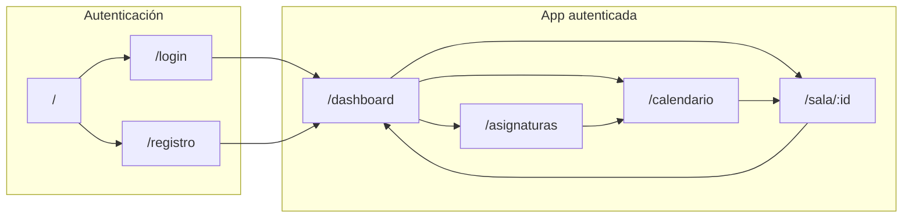

# Agora — Design & Product Handoff

**Proyecto:** 750018C Proyecto Integrador I — 2026-I  
**Producto:** Agora — salas de estudio virtuales en tiempo real  
**Versión del handoff:** 1.3  
**Fecha:** 27 de mayo de 2026  
**Copy canónico:** [docs/COPY.md](./COPY.md) · `src/copy/es.ts`  
**Figma (fuente de diseño):** [Agora](https://www.figma.com/design/8IIfK1NI50mAXFC588WnjI/Agora)

---

## 1. Resumen ejecutivo

Agora es una aplicación web colaborativa para estudiantes que simula la interacción síncrona de un
salón de estudio físico. El MVP debe permitir autenticación, gestión de salas privadas, chat
persistente en tiempo real y comunicación audiovisual (WebRTC) incluyendo compartición de pantalla.

Este documento entrega el puente **diseño → implementación**: pantallas disponibles en Figma,
trazabilidad con las tareas núcleo del enunciado (T1–T4), arquitectura de información, tokens
visuales, flujos de usuario y brecha respecto al código actual en React.

**Textos de interfaz:** usar [COPY.md](./COPY.md) y `src/copy/es.ts` como fuente única. No
implementar strings sueltos en componentes.

---

## 2. Problema y objetivo (alineación con el enunciado)

| Dimensión               | Descripción                                                                                                                                      |
| ----------------------- | ------------------------------------------------------------------------------------------------------------------------------------------------ |
| **Problema**            | Herramientas existentes son pesadas o genéricas; falta un espacio virtual ligero orientado al estudio síncrono.                                  |
| **Objetivo**            | App web funcional, accesible y desplegada con registro/auth, salas de estudio, chat con historial, AV en tiempo real y compartición de pantalla. |
| **Stack frontend**      | React + TypeScript + Tailwind CSS                                                                                                                |
| **Stack backend**       | Node.js + TS, Firebase Auth + Firestore, WebSockets + WebRTC (Render)                                                                            |
| **Despliegue frontend** | Vercel                                                                                                                                           |

---

## 3. Tareas núcleo — trazabilidad diseño ↔ producto

Use esta tabla en la documentación del proyecto y en pruebas de usuario.

| ID     | Tarea núcleo                 | Pantallas / componentes Figma                                                                                    | Rutas objetivo (React)                                           | Backend / realtime                                               |
| ------ | ---------------------------- | ---------------------------------------------------------------------------------------------------------------- | ---------------------------------------------------------------- | ---------------------------------------------------------------- |
| **T1** | Gestión de identidad y salas | `Landing`, `Login`, `Registro`, `Perfil`, `Dashboard`, `Crear Reunión`, `Unirse a reunión`                       | `/`, `/login`, `/registro`, `/dashboard`, `/sala/:id`, `/perfil` | Firebase Auth (email + **Google**), Firestore (`users`, `rooms`) |
| **T2** | Chat e historial             | Panel lateral de chat en `Sesion Actual` (por diseñar en detalle)                                                | `/sala/:id` (panel chat)                                         | WebSockets + Firestore `messages`                                |
| **T3** | Interacción AV               | `Sesion Actual`: stage de video, controles mic/cámara, indicador “En vivo”, lista de participantes (por ampliar) | `/sala/:id`                                                      | WebRTC (signaling vía backend)                                   |
| **T4** | Compartición de pantalla     | Botón “Compartir pantalla” en barra de controles de sala (por añadir en Figma e implementar)                     | `/sala/:id`                                                      | WebRTC `getDisplayMedia`                                         |

### Criterios de aceptación UX por tarea

**T1**

- Usuario puede registrarse e iniciar sesión con **correo/contraseña** o **Google Sign-In**, con
  retroalimentación clara (éxito / error).
- Desde el dashboard puede crear una sala (asunto, **asignatura**, fecha, hora, **invitados**) o
  unirse con código.
- Puede ver próximas sesiones y entrar con un CTA explícito (“Ir a reunión”).

**T2**

- Mensajes aparecen en tiempo real para todos los miembros de la sala.
- Al reingresar a la sala, el historial se carga desde Firestore.
- Estados: enviando, enviado, error de conexión.

**T3**

- Video/audio opcionales con toggles visibles y estado reflejado en UI (encendido/apagado).
- Lista o indicadores de usuarios conectados y estado de cámara/micrófono.

**T4**

- Un botón dedicado inicia/detiene compartición de pantalla.
- Otros participantes ven el stream compartido en el stage principal o layout secundario.

---

## 4. Inventario de pantallas (Figma)

### Página: **Dashboard**

| Frame                          | Estado diseño                | Descripción                                                           |
| ------------------------------ | ---------------------------- | --------------------------------------------------------------------- |
| **Dashboard Principal**        | ✅ Listo para implementación | Shell app: sidebar, navbar, próximas sesiones, crear/unirse a reunión |
| **SesionItem** (component set) | ✅ Componente                | Variantes: Software II, IA, Proyecto Integrador                       |

### Página: **Views**

| Frame                        | Estado diseño               | Descripción                                         |
| ---------------------------- | --------------------------- | --------------------------------------------------- |
| **Asignaturas**              | ✅ Wireframe alto fidelidad | Tarjetas por materia con conteo de sesiones         |
| **Calendario**               | ✅ Wireframe alto fidelidad | Vista mensual (Mayo 2026) con sesiones marcadas     |
| **Sesion Actual**            | ✅ Wireframe alto fidelidad | Sala en vivo: header, stage AV, controles básicos   |
| **Sesion Actual - Completa** | ✅ Listo (T2–T4)            | Chat lateral, participantes, mic/cám/pantalla/salir |
| **Perfil**                   | ✅ Listo (T1)               | Ver/editar perfil, guardar cambios, eliminar cuenta |

### Página: **Auth**

| Frame                 | Estado diseño | Descripción                                                                  |
| --------------------- | ------------- | ---------------------------------------------------------------------------- |
| **Home**              | ✅ Listo      | Variante compacta en página Auth                                             |
| **Landing**           | ✅ Listo      | Entrada pública; **Continuar con Google** como CTA principal                 |
| **Login**             | ✅ Listo      | Google + correo/contraseña, enlace a registro                                |
| **Registro**          | ✅ Listo      | Google + formulario completo (6 campos), estados default/foco/error/carga    |
| **Google — Username** | ✅ Listo      | Modal post-OAuth: default, carga (verificación BD), error (username ocupado) |

### Página: **Dashboard** (modales)

| Frame                     | Estado diseño | Descripción                  |
| ------------------------- | ------------- | ---------------------------- |
| **Modal - Editar Sala**   | ✅ Listo      | Confirmar edición de reunión |
| **Modal - Eliminar Sala** | ✅ Listo      | Confirmación destructiva     |

### Página: **States**

| Frame            | Estado diseño | Descripción                |
| ---------------- | ------------- | -------------------------- |
| **Loading**      | ✅ Referencia | Carga de sesiones          |
| **Empty**        | ✅ Referencia | Sin sesiones programadas   |
| **Error Auth**   | ✅ Referencia | Fallo correo/contraseña    |
| **Error Google** | ✅ Referencia | Fallo popup / OAuth Google |
| **Error WebRTC** | ✅ Referencia | Fallo de conexión AV       |

### Prototipo interactivo

| Flujo                                          | Estado                                                      |
| ---------------------------------------------- | ----------------------------------------------------------- |
| Home → Login / Registro (misma página Auth)    | ✅ Hotspots cableados                                       |
| Registro Default → Cargando (clic CTA)         | ✅ Hotspot cableado                                         |
| Login/Registro → Google Username (clic Google) | ✅ Hotspot cableado                                         |
| Google Username → Cargando (clic CTA)          | ✅ Hotspot cableado                                         |
| Auth → Dashboard → Sala (cross-page)           | ⏳ Conectar manualmente en Figma Prototype (limitación API) |
| Avatar → Perfil                                | ⏳ Conectar en Prototype mode                               |

### Pendiente en Figma (opcional / iteración)

| Pantalla                            | Prioridad   | Notas                                             |
| ----------------------------------- | ----------- | ------------------------------------------------- |
| **Prototipo cross-page completo**   | Media (HCI) | Enlace Auth → Dashboard → Views en modo Prototype |
| **Panel chat mobile (drawer)**      | Media       | Variante responsive de Sesion Actual - Completa   |
| **Confirmación eliminar cuenta**    | Media       | Modal secundario desde Perfil                     |
| **Formulario editar sala (campos)** | Baja        | Ampliar modal Editar con inputs                   |

---

## 5. Brecha diseño vs código (mayo 2026)

| Pantalla Figma           | Ruta actual  | Estado código                                     |
| ------------------------ | ------------ | ------------------------------------------------- |
| Login                    | `/login`     | Placeholder (tema oscuro, sin formulario real)    |
| Registro                 | `/registro`  | Placeholder (tema oscuro, sin formulario real)    |
| Dashboard Principal      | `/dashboard` | Placeholder (tema oscuro, no coincide con Figma)  |
| Asignaturas              | —            | **Ruta no existe**                                |
| Calendario               | —            | **Ruta no existe**                                |
| Sesion Actual - Completa | `/sala/:id`  | Placeholder AV básico (sin chat ni participantes) |
| Home                     | `/`          | Landing mínima (no alineada a Figma)              |
| Perfil                   | —            | **Ruta no existe**                                |

**Decisión de diseño para implementación:** adoptar el **tema claro** de Figma como sistema visual
principal de la app autenticada. Auth y app shell deben compartir tokens (`#f6f7f8`, `#165dfb`,
`#eff6ff`, `#e5e7eb`).

---

## 6. Arquitectura de información y rutas

### Mapa de navegación propuesto

```text
/                          Landing (marketing / acceso)
/login                     Iniciar sesión
/registro                  Crear cuenta
/completar-username        Username obligatorio tras Google OAuth (usuarios nuevos)
/dashboard                 Panel principal (default post-login)
/asignaturas               Listado de materias
/calendario                Vista calendario
/sala/:id                  Sala de estudio en vivo (Sesión Actual)
/perfil                    Ver/editar perfil (por implementar)
```

### Flujos principales



### Shell de aplicación (patrón repetido)

Todas las vistas autenticadas excepto `/sala/:id` en modo inmersivo comparten:

1. **Sidebar** (273px): título “Dashboard Principal”, nav con estado activo, marca **Agora** al pie.
2. **Navbar** (82px): búsqueda global, campana, avatar de usuario.
3. **Área de contenido**: scroll vertical, tarjetas blancas con borde `#e5e7eb`.

`/sala/:id` puede usar el mismo shell con nav “Sesión Actual” activo, o un layout inmersivo
full-width; el frame Figma actual mantiene el shell.

---

## 7. Design tokens

Extraídos del archivo Figma. Usar en `tailwind.config.js` como extensión del tema.

| Token                  | Valor     | Uso                                          |
| ---------------------- | --------- | -------------------------------------------- |
| `color-bg-app`         | `#f6f7f8` | Fondo general                                |
| `color-surface`        | `#ffffff` | Tarjetas, sidebar, navbar                    |
| `color-border`         | `#e5e7eb` | Bordes, inputs                               |
| `color-primary`        | `#165dfb` | Botones primarios, links, nav activo (texto) |
| `color-primary-soft`   | `#eff6ff` | Fondo nav item activo                        |
| `color-text-primary`   | `#000000` | Títulos                                      |
| `color-text-secondary` | `#727272` | Placeholders, metadatos                      |
| `color-danger`         | `#b91c1c` | Salir de sala / acciones destructivas        |
| `color-live`           | `#34d399` | Indicador “En vivo”                          |
| `color-avatar`         | `#1e4d3a` | Avatar placeholder                           |

### Tipografía

- **Familia:** Inter (Bold / Regular) — cargar vía Google Fonts o `@fontsource/inter`.
- **Escala:** títulos de sección 20px bold; títulos de tarjeta 18–20px; cuerpo 14–16px; labels
  12–14px.

### Radios y espaciado

- Inputs / tarjetas pequeñas: `8px`
- Botones primarios: `10–12px`
- Tarjetas auth: `12px`
- Padding estándar de tarjeta: `20px`
- Gap entre columnas en dashboard inferior: `20px`

---

## 8. Componentes — inventario y mapeo React

| Componente Figma       | Variantes / estados                      | Props sugeridas (React)                 | Ubicación código sugerida             |
| ---------------------- | ---------------------------------------- | --------------------------------------- | ------------------------------------- |
| **SesionItem**         | Software II, IA, Proyecto Integrador     | `title`, `dateLabel`, `onJoin`          | `components/SesionItem.tsx`           |
| **Sidebar / Nav item** | default, active                          | `icon`, `label`, `to`, `active`         | `components/layout/Sidebar.tsx`       |
| **Navbar**             | —                                        | `onSearch`, `user`                      | `components/layout/Navbar.tsx`        |
| **Searchbar**          | —                                        | `placeholder`, `value`, `onChange`      | `components/Searchbar.tsx`            |
| **Auth card**          | login, registro                          | `children`, `title`, `subtitle`         | `components/auth/AuthCard.tsx`        |
| **Input field**        | —                                        | `label`, `type`, `error`, `...register` | `components/ui/Input.tsx`             |
| **Primary button**     | default, loading, disabled               | `loading`, `children`                   | `components/ui/Button.tsx`            |
| **Crear reunión form** | Asunto, asignatura, fecha, hora, invitar | `onSubmit`                              | `components/rooms/CreateRoomForm.tsx` |
| **Unirse form**        | —                                        | `onJoin(code)`                          | `components/rooms/JoinRoomForm.tsx`   |
| **Video stage**        | empty, connected, screen-share           | `streams`, `layout`                     | `components/sala/VideoStage.tsx`      |
| **Control bar**        | mic on/off, cam on/off, screen, leave    | handlers + estados                      | `components/sala/ControlBar.tsx`      |
| **Chat panel**         | _(por diseñar)_                          | `messages`, `onSend`                    | `components/sala/ChatPanel.tsx`       |

---

## 9. Especificación por pantalla

### 9.1 Landing (`Auth > Landing` · ruta `/`)

- Hero orientado a Google: **Continuar con Google** como acción principal.
- Secundario: **Usar correo y contraseña** → `/login`.
- Nota de confianza bajo los CTAs (ver `auth.google.trustNote` en copy).
- Tras OAuth exitoso: si el usuario **ya tiene username** en Firestore → `/dashboard`; si no →
  `/completar-username`.

### 9.2 Login (`Auth > Login`)

- **Continuar con Google** arriba del formulario; separador **o continúa con correo**.
- CTA Google → popup OAuth → si usuario nuevo sin username → **`Google — Username`** (modal
  bloqueante).
- CTA correo: **Iniciar sesión** → `/dashboard` tras Firebase Auth (usuario existente).
- Errores Firebase/Google: mostrar bajo el formulario o como toast.

### 9.2.1 Google OAuth — Username (`Auth > Google — Username` · ruta `/completar-username`)

- **Intercepta** al usuario justo después de Google OAuth cuando falta `username` en Firestore.
- UI: **modal centrado** sobre overlay semitransparente (45 %); muestra badge _Cuenta verificada con
  Google_, avatar/nombre/correo de Google y un único campo **Nombre de usuario**.
- **Estados Figma:** `Google — Username`, `Google — Username — Cargando`,
  `Google — Username — Error`.
- **Carga:** subtítulo _“Comprobando si tu nombre de usuario está disponible...”_, nota
  _“Verificando en la base de datos...”_, CTA _“Verificando...”_ + spinner, campo disabled.
- **Error (username ocupado):** borde rojo + _“Este nombre de usuario ya está en uso. Prueba con
  otro.”_
- CTA éxito → crea/actualiza documento `users` en Firestore → `/dashboard`.
- Decisiones en `docs/BITACORA.md` entradas 4 y 5 (modal vs ruta, visibilidad de carga).

### 9.3 Registro (`Auth > Registro`)

- **Continuar con Google** (cuenta nueva o existente según Firebase).
- Si OAuth exitoso y **sin username** → mismo flujo que §9.2.1 (`/completar-username`).
- Formulario manual con campos obligatorios: **Nombres**, **Apellidos**, **Nombre de usuario**,
  **Avatar**, **Correo**, **Contraseña**.
- Labels accesibles con asterisco `*` en campos requeridos; helpers bajo username, avatar y
  contraseña.
- **Estados Figma:** `Registro — Default`, `Registro — Foco`, `Registro — Error`,
  `Registro — Cargando`.
- **Validación inline:** borde rojo + fondo `#fef2f2` + microcopy bajo el campo (sin códigos
  Firebase).
- **Username ocupado:** “Este nombre de usuario ya está en uso. Prueba con otro.”
- **Carga:** botón deshabilitado visualmente, spinner + “Creando cuenta...”, inputs en estado
  disabled.
- CTA: **Crear cuenta** → crea usuario en Firebase + documento en Firestore.
- Prototipo navegable: Default → Cargando (clic en CTA).
- Decisiones de diseño documentadas en `docs/BITACORA.md` (heurísticas Nielsen, criterio C5 TG1).

### 9.4 Dashboard Principal

**Sección: Próximas sesiones**

- Lista de `SesionItem` con CTA **Ir a reunión** → `/sala/:roomId`
- Link **Ver calendario** → `/calendario`

**Sección inferior (dos columnas)**

- **Crear reunión:** Asunto, **Asignatura**, Fecha, Hora, **Invitar**, botón **Crear reunión**
- **Unirse a reunión:** Código (`ABC-1234`), botón **Unirse**

**Datos de ejemplo (mock hasta Firestore):**

| Materia                   | Fecha                          |
| ------------------------- | ------------------------------ |
| Desarrollo de Software II | Mar, 26 de Mayo, 13:00 – 14:30 |
| Inteligencia Artificial   | Vie, 29 de Mayo, 10:00 – 12:00 |
| Proyecto Integrador       | Sáb, 23 de Mayo, 8:00 – 10:30  |

### 9.5 Asignaturas

- Grid de tarjetas por materia
- Cada tarjeta: nombre + “N sesiones programadas”
- Click opcional → filtrar calendario o listar salas de esa materia

### 9.6 Calendario

- Vista mensual con celdas
- Días con sesión: fondo `#eff6ff`, etiqueta con nombre abreviado
- Click en día con sesión → detalle o entrada directa a sala

### 9.7 Sesión Actual (`/sala/:id`)

**Header de sala**

- Indicador **En vivo** (punto verde + texto)
- Título de la sesión (ej. “Desarrollo de Software II”)
- Timer de duración (opcional MVP)

**Stage principal**

- Área 16:9 para video remoto / pantalla compartida
- Placeholder cuando no hay stream

**Barra de controles**

- Micrófono (toggle + estado accesible)
- Cámara (toggle)
- **Compartir pantalla** (añadir — T4)
- **Salir** (rojo) → `/dashboard`, debe cerrar peers y sockets

**Por implementar en diseño y código (T2/T3)**

- Panel lateral de chat con historial
- Lista de participantes con iconos mic/cam
- Layout responsive: en móvil, chat en drawer

---

## 10. Accesibilidad (WCAG 2.2 — obligatorio)

Enfoque declarado en el enunciado: **ceguera total** (lectores de pantalla). Justificar y validar
cada pauta aplicada.

| Principio        | Pauta                           | Aplicación en Agora                                                                                  | Validación sugerida              |
| ---------------- | ------------------------------- | ---------------------------------------------------------------------------------------------------- | -------------------------------- |
| **Perceptible**  | 1.4.3 Contraste (AA)            | Texto `#727272` sobre blanco y `#165dfb` sobre blanco deben cumplir 4.5:1; verificar botones y links | axe DevTools, Lighthouse         |
| **Operable**     | 2.1.1 Teclado                   | Toda la nav, formularios y controles de sala operables con Tab/Enter/Esc                             | Prueba manual sin ratón          |
| **Operable**     | 2.4.3 Orden del foco            | Sidebar → navbar → contenido; en sala: stage → controles → chat                                      | Inspección de tabindex           |
| **Comprensible** | 3.3.1 Identificación de errores | Errores auth y red descritos en texto, no solo color                                                 | Pruebas con usuarios / checklist |
| **Robusto**      | 4.1.2 Nombre, rol, valor        | Botones mic/cam con `aria-pressed`; inputs con `<label>`; live regions para chat                     | NVDA / VoiceOver                 |

### Checklist mínima por componente

- [ ] Todo input tiene `<label>` visible o `aria-label`
- [ ] Botones icon-only tienen nombre accesible
- [ ] Focus visible en nav y controles de sala (`ring-2 ring-primary`)
- [ ] Mensajes de chat nuevos anunciados con `aria-live="polite"`
- [ ] Modales (eliminar cuenta, salir de sala) atrapan foco y cierran con Esc

---

## 11. Heurísticas de Nielsen (referencia evaluación)

| Heurística                      | Cómo se refleja en el diseño                              |
| ------------------------------- | --------------------------------------------------------- |
| Visibilidad del estado          | Indicador “En vivo”, estados mic/cam, loading en auth     |
| Coincidencia sistema–mundo real | “Salas”, “Asignaturas”, lenguaje universitario en español |
| Control y libertad              | “Salir”, “← Volver”, cerrar sesión                        |
| Consistencia                    | Shell compartido, mismos tokens en Auth y Dashboard       |
| Prevención de errores           | Confirmación al eliminar sala/cuenta (por diseñar)        |
| Reconocimiento vs recuerdo      | Nav lateral fija, búsqueda visible                        |
| Flexibilidad                    | Atajo “Unirse con código” además de crear sala            |
| Diseño estético minimalista     | Tarjetas blancas, una acción primaria por bloque          |
| Ayuda con errores               | Mensajes Firebase/WebRTC en lenguaje claro                |
| Documentación                   | Este handoff + ayuda contextual opcional en sala          |

---

## 12. Modelo de datos (referencia para frontend)

```text
users/{uid}
  displayName, email, photoURL?, createdAt

rooms/{roomId}
  title, subject?, scheduledAt?, code, ownerId, memberIds[], createdAt, updatedAt

rooms/{roomId}/messages/{messageId}
  uid, displayName, text, createdAt
```

El frontend debe tipar estas entidades en `src/types/` y consumirlas vía servicios
(`src/services/`).

---

## 13. Integraciones técnicas esperadas

| Capa                            | Responsabilidad                                               |
| ------------------------------- | ------------------------------------------------------------- |
| **Firebase Auth**               | Email/password, **Google Sign-In**, logout, delete account    |
| **Firestore**                   | Perfiles, salas, mensajes                                     |
| **API REST (Render + Swagger)** | Operaciones CRUD salas/usuarios si no van directo a Firestore |
| **WebSocket server (Render)**   | Presencia, señalización chat, eventos de sala                 |
| **WebRTC**                      | Audio, video, screen share; signaling vía WS                  |

### Variables de entorno frontend (`.env.example`)

```bash
VITE_FIREBASE_API_KEY=
VITE_FIREBASE_AUTH_DOMAIN=
VITE_FIREBASE_PROJECT_ID=
VITE_API_URL=
VITE_WS_URL=
```

---

## 14. Plan de implementación recomendado

### Fase 1 — Fundación UI (1 sprint)

1. Tokens Tailwind + Inter
2. `AppShell`, `Sidebar`, `Navbar`
3. Pantallas Auth según Figma + Firebase Auth
4. Rutas `/asignaturas`, `/calendario`

### Fase 2 — T1 Salas (1 sprint)

1. Dashboard con `SesionItem` y formularios crear/unirse
2. Integración Firestore para salas
3. Pantalla perfil (CRUD usuario)

### Fase 3 — T2 Chat (1 sprint)

1. Diseñar panel chat en Figma (si falta)
2. WebSocket + UI chat + historial Firestore

### Fase 4 — T3/T4 AV (1–2 sprints)

1. WebRTC audio/video en `Sala`
2. Compartir pantalla + layout multi-participante
3. Estados de conexión y errores

### Fase 5 — Calidad (continuo)

1. Responsive (sidebar colapsable en móvil)
2. Auditoría WCAG + pruebas de usuario
3. Prototipo Figma navegable para evaluación HCI

---

## 15. Entregables de diseño completados vs pendientes

| Entregable                             | Estado                       |
| -------------------------------------- | ---------------------------- |
| Dashboard Principal pulido             | ✅ Figma                     |
| Componente SesionItem                  | ✅ Figma                     |
| Asignaturas, Calendario, Sesión Actual | ✅ Figma                     |
| Sesión Actual - Completa (T2–T4)       | ✅ Figma                     |
| Perfil, Home, modales sala             | ✅ Figma                     |
| Estados Loading / Empty / Error        | ✅ Figma                     |
| Login y Registro                       | ✅ Figma                     |
| Prototipo Auth (Home → Login/Registro) | ✅ Figma                     |
| Prototipo cross-page completo          | ⏳ Manual en Figma Prototype |
| Implementación React alineada a Figma  | ⏳ Pendiente                 |

---

## 16. Enlaces y contacto

| Recurso                                   | URL                                                       |
| ----------------------------------------- | --------------------------------------------------------- |
| Figma — archivo Agora                     | https://www.figma.com/design/8IIfK1NI50mAXFC588WnjI/Agora |
| Repo frontend                             | `proyecto-integrador-frontend`                            |
| FigJam — flujo de navegación (referencia) | Generado en sesión previa; útil para documentación        |

---

## 17. Decisiones abiertas (requieren acuerdo del equipo)

1. **¿Landing `/` en tema claro o oscuro?** Figma usa claro; código actual usa oscuro.
2. **¿Sala inmersiva sin sidebar o con shell?** Figma actual mantiene shell.
3. **¿“Asignaturas” es entidad de Firestore o solo agrupación UI de salas?**
4. **¿Código de sala formato `ABC-1234` generado server-side o client-side?**
5. **¿Chat global por sala o también DMs?** MVP: solo por sala.

---

_Documento generado para handoff diseño → desarrollo. Actualizar versión cuando cambien frames en
Figma o alcance del MVP._
